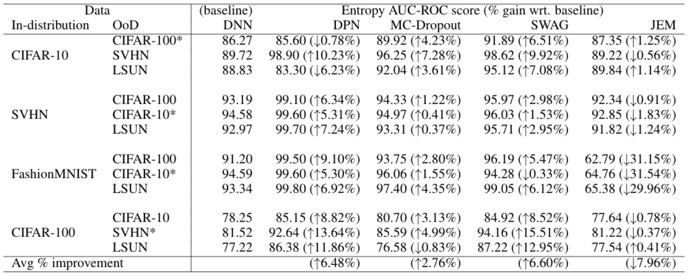

 # Evaluating uncertainty estimation
 ## bayesian deep learning vs. point estimate deep learning 

 - Bayesian deep learning methods
   - MC-Dropout
   - SWAG
   - DPN
   - JEM

- Datasets

  | Train/In Distribution | Test/Out Distribution |
  | --------------------- | --------------------- |
  | CIFAR10               | {CIFAR100, SVHN, LSUN}|
  | FashionMNIST          | {CIFAR100, CIFAR10, LSUN}|
  | CIFAR100              | {CIFAR10, SVHN, LSUN}|
  | SVHN                  | {CIFAR100, CIFAR10, LSUN}|

- Pretrained Models

  | Pretrained WideResNet28x10 on CIFAR10         |
  | --------------------------------------------- |
  | [DNN](https://drive.google.com/file/d/1hVDuwDvlr3o32QVyfMwmdrtAV7u85ZR9/view?usp=sharing) |
  | [MC-Dropout](https://drive.google.com/file/d/1WTNEsKMTNhm8LULA9ud3D558PRXwkbhI/view?usp=sharing) |
  | [SWAG](https://drive.google.com/file/d/18vxlAPT_xjg_HMFeM1qPKKajopvBXJ5y/view?usp=sharing) |
  | [DPN](https://drive.google.com/file/d/1eiovYIXnf9fpYdbTdamBeyjnzWt6PhGV/view?usp=sharing) |
  | [JEM](http://www.cs.toronto.edu/~wgrathwohl/CIFAR10_MODEL.pt) |

- Results


- <u>Code Attribution</u>
  - [Stochastic Weight Averaging of Gaussian](https://github.com/wjmaddox/swa_gaussian)
  - [Dirichlet Prior Networks](https://github.com/KaosEngineer/PriorNetworks)
  - [Joint Energy Models](https://github.com/wgrathwohl/JEM)

- Cite
```
@inbook{mitros2020,
  author =        {Mitros, John and Pakrashi, Arjun and
                   Mac Namee, Brian},
  pages =         {71-87},
  series =        {European Conference on Computer Vision},
  title =         {Ramifications of Approximate Posterior Inference for
                   Bayesian Deep Learning in Adversarial and
                   Out-of-Distribution Settings},
  year =          {2020},
  publisher =     {Springer},
  doi =           {10.1007/978-3-030-66415-2{\_}5},
  isbn =          {978-3-030-66414-5},
}
```
